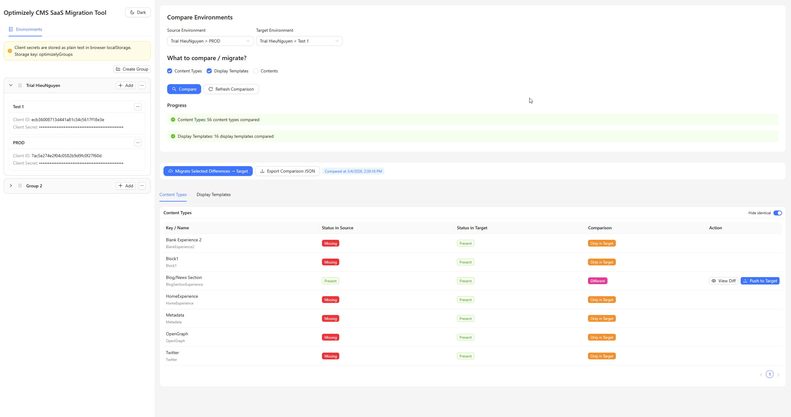

# Optimizely CMS SaaS Migration Tool

Single-page browser application for comparing and migrating Optimizely CMS SaaS entities across environments.



## Tech Stack

- React 19 + TypeScript + Vite
- Ant Design
- Browser `fetch` only
- `localStorage` persistence only (`optimizelyGroups`)

## Features

- Environment management (add/edit/delete)
- OAuth2 Client Credentials auth per environment
- Comparison of:
  - Content Types
  - Display Templates
  - Contents (recursive tree)
- Status matrix (`Only in Source`, `Only in Target`, `Different`, `Identical`)
- Diff preview modal for changed entities
- Per-item push and bulk migration to target environment
- Migration progress modal with live logs and notifications
- Export comparison result as JSON
- Dark mode toggle

## Getting Started

```bash
npm install
npm run dev
```

Open the local Vite URL printed in your terminal.

## Notes

- Environment secrets are stored as plain text in browser `localStorage` (under `optimizelyEnvs`).
- The app runs without a backend.
- The app uses `/optimizely-proxy` for API calls:
  - In local development, Vite proxy forwards this path to `https://api.cms.optimizely.com`.
  - In Vercel deployments, `vercel.json` rewrite forwards this path to `https://api.cms.optimizely.com`.
- Optional override: set `VITE_API_ORIGIN` if you need a different API base URL.
- API endpoints used are under:
  - `https://api.cms.optimizely.com/oauth/token`
  - `https://api.cms.optimizely.com/preview3/...`

## Scripts

- `npm run dev` — start local dev server
- `npm run build` — type-check + production build
- `npm run preview` — preview production build
